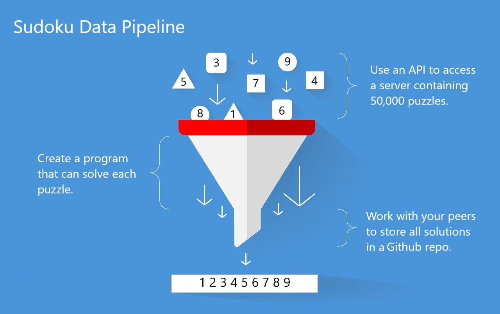

# **SUDOKU PIPELINE LESSON**

## In this project, you will be taught how to create a data pipeline. 

#### An api has been set up to allow you access to 50,000 sudoku puzzles. Your task is to create a pipeline that automates the retrieval, solving, and saving of those puzzles. At the end of the week, your peers will have a public Github repo of all 50,000 sudoku puzzles coupled with their solutions. 

 

#### Check out api_example.py in the /src folder. I've already put together an outline of a custom Python class that you can use to design your pipeline. You should start by reading through the entire document, then discussing the problem with your classmates. You will need the full participation of everyone to get all 50,000 puzzles, so make sure and take some time at the beginning to make sure everyone feels confident in their game plan.

 

#### It might be a good idea to take this assignment in stages. Keep in mind that if you wait until you have finished building your entire pipeline before you start pulling puzzles from the API, you most likely will not have enough time left to acquire every puzzle. This is because the API throttles pull requests. Instead, you should start pulling puzzles as soon as possible, making sure to save them in a secure location. 

 

#### Once your API requesting is running smoothly, you should start working on a second program that can solve sudoku puzzles. All the puzzles on the API are of the 'easy' difficulty level, so feel free to start with a simple program and then make if more complex if it need be. (But most likely, the simplest sudoku solving program will work for all puzzles.)

 

#### If you need some help on this part, feel free to google about it. While it is never ok to simply copy someone else's code as your own, every coder can learn a lot by researching a previously solved problem. Don't feel like you have to reinvent the wheel here. (And trust me, this problem has been solved many times before!) If you are worried that you might be plagerizing, just ask yourself: 'Do I understand how this code works? And if I restarted this project, could I write this code again from scratch?' If you answer no to either of those qeustions, then you are not ready to move on.

 

#### You can use all the sudoku puzzles you have acquired from the API to test your sudoku solver program. You can also ask your peers to share some of their (puzzle,solution) pairs for comparrison. Once your program is working, try integrating it into your pipeline so that every step of your pipeline is automated. Your APIClient object should pull new puzzles from the API, solve them, and store the (puzzle,solution) pair to a csv, all without any involvment from you.

 

#### At a certain point, the API will run out of puzzles. Each of your classmates will now have a unique set of puzzles, and (as long as everything went as planned...) every one of the 50,000 puzzles will be stored on one of you classmates computers. It's time to combine them into one place. Choose one person who will create a Github repo for storing all the data. Have them include one csv file that you will all add your solutions to. Then take turns adding all your solutions to it! Keep in mind to not create merge conflicts.

 

#### At the end of this project, you will have created a real world data pipeline, not unlike those used by data scientists in industry. API's are a common tool used for collecting data in real time. You often won't have a pipeline built before the API, making it necessary to store data while working on the data transformation stage. This process evolves quickly, giving necessity to thorough testing in order to ensure no data is lost in the process.

 

#### In this project, we stop after creating a public git repo containing a csv of our data. However, in real life our pipeline data would be stored in a database and used to make insightful observations about the world. If you would like to take this project to another level, try storing your pipeline data in a database. I would suggest using a SQL or mongoDB database. Setting these up is beyond the scope of this lesson, but there are plenty of tutorials online.

 

#### Good work, everyone! I know you you will do great.

